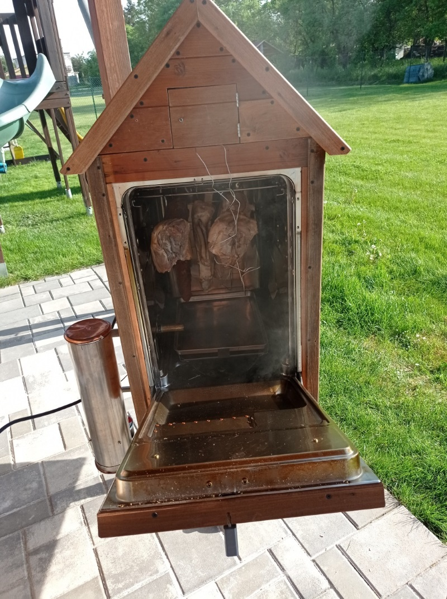
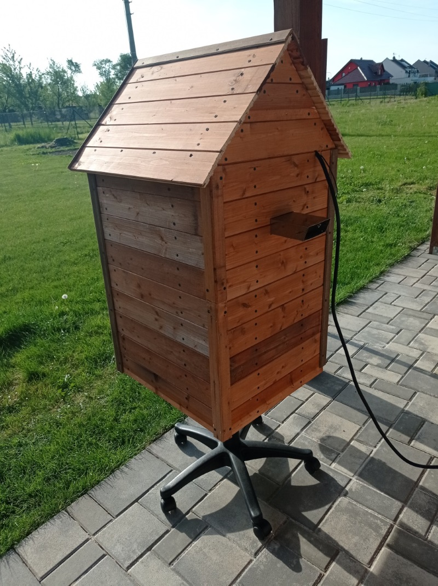
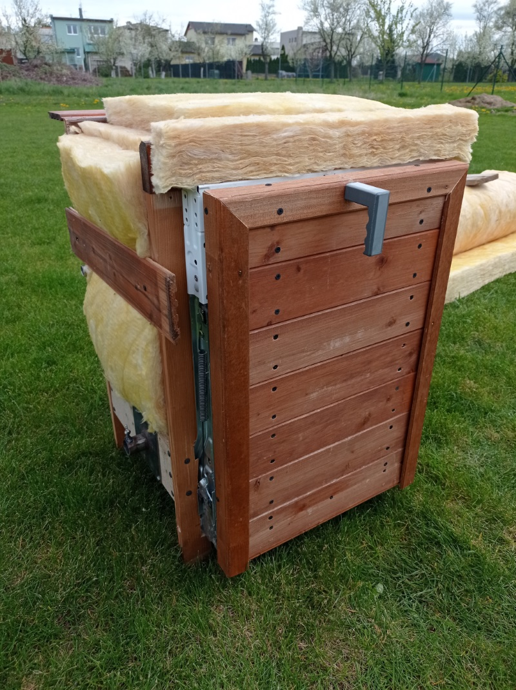
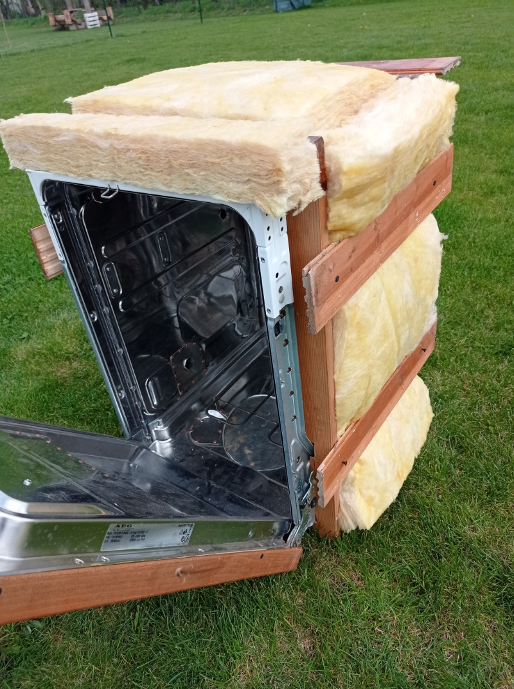
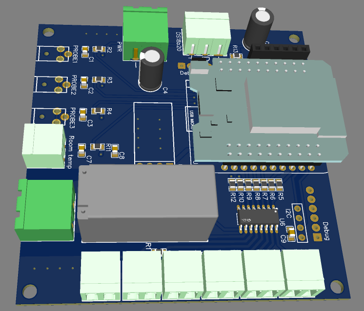
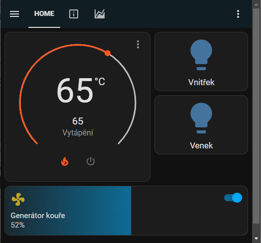
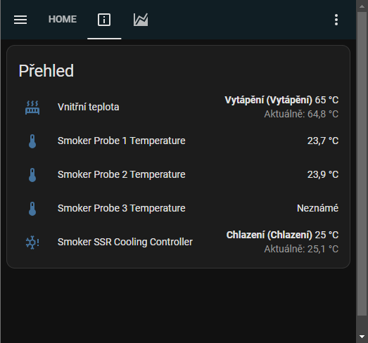
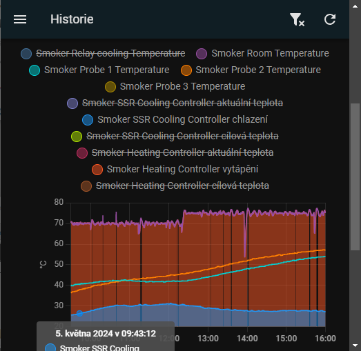

# Udírna z myčky nadobí řízená ESPHome
 

## Úvod

Udírna je vyrobena z komponent "co dům dal". Jako srdce udírny jsem zvolil využít [ESP32 LIVE MiniKIT](https://www.laskakit.cz/mh-et-live-esp32-minikit--wemos-d1-mini-shield-kompatibilni/), který lze snadpro programovat pomocí projektu [esphome.io](https://esphome.io/) v kombinaci s [HomeAssistant](https://www.home-assistant.io/). Oba tyto projekty poskytují veškerý komfort pro snadné, přesné a pohodlné ovládání. Pro topení jsem použil topnou spirálu z trouby o příkonu 1800W.

### Vlastnosti

- topná spirála řízena proporčně pomocí SSR
- teplota udírny měřena pomocí teplotního čidla NTC
- proporční řízení ventilátoru generátoru kouře
- 3 na sobě nezávislé teplotní sondy do masa
- ovládání 2 okruhů osvětlovacích LED pásků
- aktivní chlazení SSR – teplotní čidlo DS18B20 + chladič procesoru PC
- 1 spínatelný výstup 12V a 1 relé pro strýčka příhodu

## Konstrukce

Pro výrobu domácí hobby udírny jsem využil starou vyřazenou myčku nádobí. Myčku jsem vykuchal, a ponechal si pouze nerezovou krabici. Vše jsem důkladně očistil. Vnější asfaltovou izolaci jsem z nerezové krabice z velké části po nahřátí horkovzdušnou pistolí odstranil špachtlí a následně dočistil technickým benzinem. Technické otvory myčky uvnitř krabice jsem zaslepit kusy nastříhaných nerezových plechů a přinýtoval. 

Na plechový box jsem zvenčí našrouboval dřevěné laty a prostor mezi nimi vyplnil 6cm Ursa izolační vatou. Aby to celé hezky vypadlo, obouchal jsem celou krabici palubkama. Kuří noha je ze staré kancelářské židle.

 

## Řídící elektronika

Jak již bylo zmíněno výše, srdcem udírny levný modul ESP32 LIVE MiniKIT. Schéma a data plošného spoje jsou uloženy v adresáři **PCB**. Ploštý spoj je nakreslený v programu [EasyEDA](https://easyeda.com/).

## Obslužný program

Zdrojový kód obslužného programu ve skriptovacím jazyce ESPHome YAML je k nalezení v souboru ESPHome/smoker.yaml. Zde je pouze nutné doplni API klíč pro spojení s HomeAssistant.

YAML obsahuje veškerou konfiguraci řídícího programu a to včetně všech teplotních čidel, PID regulátoru topení udírny, PID regulátoru chlazení SSR, PWM výstupů pro generátor kouře a ostatní digitální výstupy.

Integrace do HomeAssistant je pak velmi snadná a může vypadat třeba takto:

  